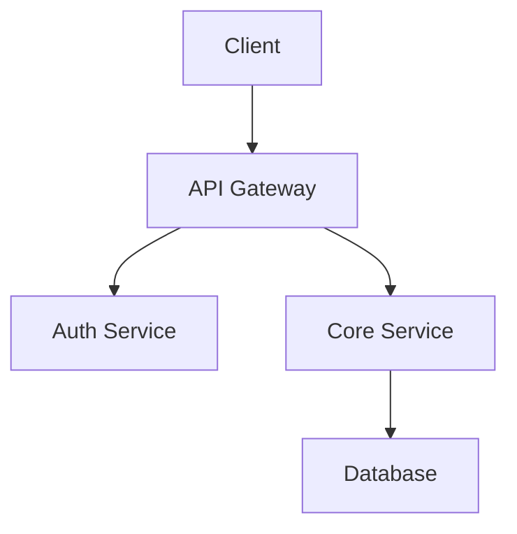
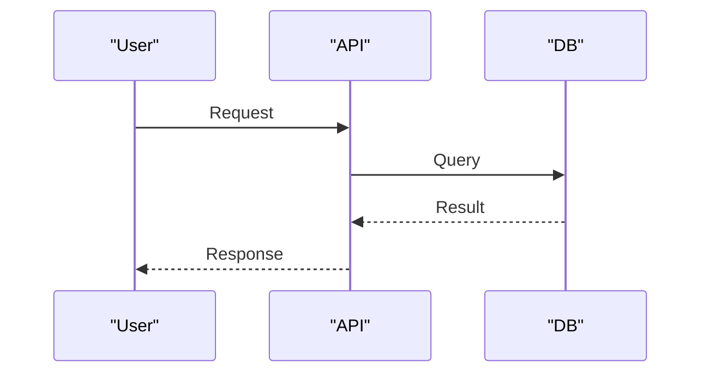
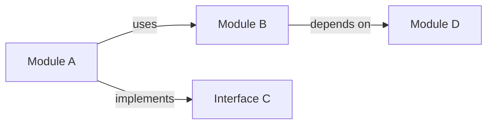

# Mermaid Diagram Reference

## Safe Mermaid Rules (mermaid injection is real)

- NEVER use `click` directives — they execute JavaScript in browser renderers
- NEVER use HTML labels (`<b>`, `<script>`, etc.) — use plain text labels only
- NEVER embed URLs in node definitions — use a separate legend or prose links
- Keep node labels to alphanumeric text, hyphens, and spaces — no special characters from code symbols without sanitizing
- Wrap all node labels in double quotes to prevent syntax injection: `A["Auth Service"]`

## Common Diagram Types

### System Overview (graph TD)

### Data Flow (sequenceDiagram)

### Component Relationships (graph LR)

